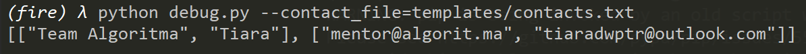
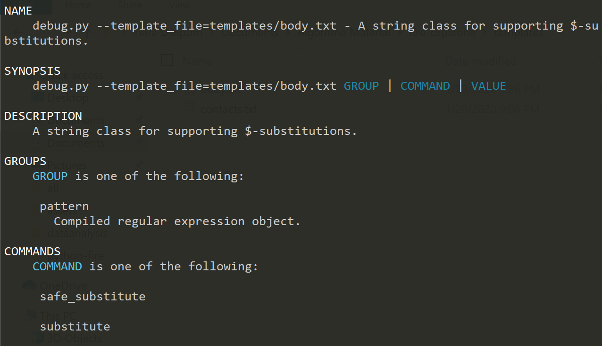
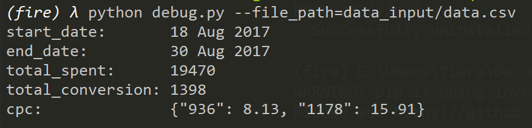
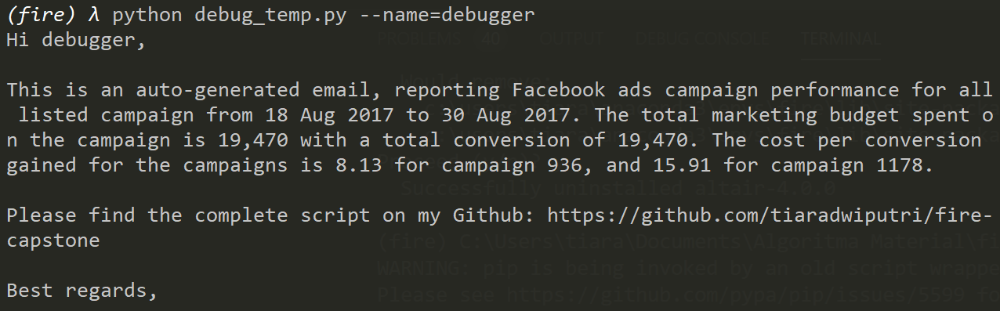
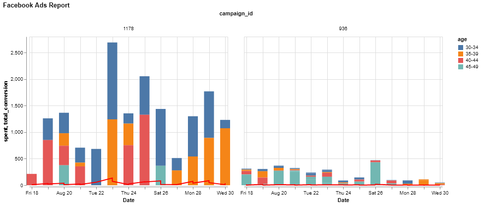
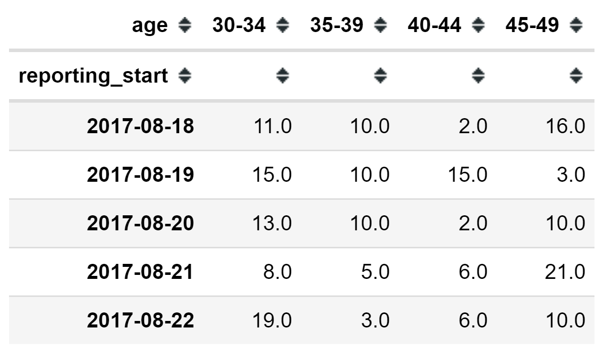

If you need an Indonesian version of this `README` please access other markdown file: `README_INDONESIAN.md`

# Auto Generated Email Based Report

This is developed as one of Algoritma Academy Data Analytics Specialization using capstone Projects. The deliverables of this project is a python script to send an automated generated email using SMTP using Outlook email host. We will also utilize Google's `fire` package for easy interfacing with bash command. 

## Setup

There are few prerequisites needed for this project, first you will need to prepare a new conda environment installed with all package dependencies. Run the following command to create a new conda environment from `requirements.txt`:

```
conda env create -n <env_name> python=3.7
conda activate <env_name>
pip install -f requirements.txt
```

Since it is beneficial for us to create a draft using Jupyter Notebook, let's also create an iPython Kernel using the following command:

```
python -m ipykernel install --user --name=<env_name>
```

## The Challenge

In this capstone project, you will try to complete 4 challenges:

1. Testing application modularity using `fire`
2. Extract data frame information to compose an email
3. Login to your Outlook email using Python's SMTP library
4. Export a plot using matplotlib to be attached to the email

Finally, you will need to complete the final mission by sending us an auto generated email to a specified email.

### Application Modularity

This module is designed to support email blast to multiple recipients at a time. The contacts list is stored on external file under `templates/contacts.txt`. Each line will represent 1 contact list with the following format:

`person name email`

The string stated in before email string will be used to address the person in the email. For example the following contact list:

`Team Algoritma mentor@algorit.ma`

will be separated into two variables:
- Name: Team Algoritma
- Email: mentor@algorit.ma

The code that support this is stored under `extract_contacts` function defined in the script. To do that, we can create a simple debugging script. Take a look at the following script, you can copy and paste it and save it under `debug.py`:

```
from send_email import extract_contacts
import fire

if __name__ == '__main__':
  # Export to Fire
  fire.Fire(extract_contacts)
```

This chunk of code is simply exporting `extract_contacts` function accessible in our CLI. Then, you should be able to perform the following command in a CLI: `python debug.py --contact_file=templates/contacts.txt`

If you have set the function properly, it should extracted 2 elements list, one containing all names and one containing all emails. Try to edit the `contacts.txt` stored within templates folder, and change the list into mentor@algorit.ma and your own email. See if it produce a similar output with the following example:



### Extract Information and Compose an Email

#### Using a Template Object

To compose the email body effectively, we'll be using a `Template` object. The object will be created from an external file stored under `templates/body.txt`. If you open the file, you should see several variables you will need to fill in as part of the capstone requirement:

- `PERSON_NAME`: You will fill this in on each name from the [Contacts List](#application-modularity)
- `START_DATE`, `END_DATE`, `TOTAL_SPENT`, `TOTAL_CONVERSION`, and `CPC`: You need to extract the specified information from the data source under `extract_summary` function using `pandas` exploratory tools you have learned. Please see the full detail for this parameter under the [Data Sumary](#extracting-data-frame-summary) section
- `GITHUB_LINK`: You can either change the template txt file into a hard-coded Github link or assign it on your Python script under the `compose_email` function

This steps is completed under `create_template` function. Try to use `Fire` to export the `create_template` function like the previous section to make sure it is returning a template object like expected:



#### Extracting Data Frame Summary

In this section you will need to extract all the variables listed in the second point from the templates object: `START_DATE`, `END_DATE`, `TOTAL_SPENT`, `TOTAL_CONVERSION`, and `CPC`. This process is completed under `extract_summary` function. The data we'll be using is stored under `data_input` folder named `data.csv`. It was downloaded from [Kaggle dataset repository](https://www.kaggle.com/madislemsalu/facebook-ad-campaign) provided by [Madis_Lemsalu](https://www.kaggle.com/madislemsalu). The data contains daily ads report run on Facebook, showing different marketing campaign from 18th to 30th of August 2017. Please refer to the following glossary of the variables:

- ad_id: Unique identifier of the daily ads
- reporting_start: The start date of the generated report. Since it is a daily report, this variable and `reporting_end` will have the same value
- reporting_end: The end date of the generated report. Since it is a daily report, this variable and `reporting_start` will have the same value
- campaign_id: unique identifier of a campaign, one campaign could have several creative ads
- fb_campaign_id: Facebook's identifier of each running ads
- age: The age group on which the ad is promoted
- gender: The gender on which the ad is promoted
- interest1, interest2, and interest3: The interest group id on which the ad is promoted
- impressions: Number of people viewing the ad
- clicks: Number of people clicking the ad
- spent: Amount of marketing cost spent
- total_conversion: Number of conversions (commonly a buying action) happened
- approved_conversion: Number of approved conversions after cross checked with the actual business. In some cases, a conversion tracked by the ad doesn't really record with a complete buying action from the customers.

For this steps, you might want to use Jupyter Notebook to perform a more complex data wrangling process. The expected final dictionary value to be returned by the function should be like the following:




Try to play around in your Jupyter Notebook and find out the appropriate code you can use to fill in the blank (`___`) space in the application script!

#### Composing an Email

If you have completed 2 previous steps, you will be able to compose an email. Try to use the `debug_temp.py` script I have included in the repository and run it in your CLI. It should be able to print out the template's variables filled in with the extracted information from the previous steps:



### SMTP Setup

The SMTP setup is managed within `authenticate_account` function. The default email host used is an Outlook server. The `smtplib` library will manage SSL authetication for your email address. For security purposes, you will need to set up an environment variables on your local machine called `EMAIL_ADDRESS` and `EMAIL_PASSWORD`. This is done to avoid having to hard code your email and password on the script and risking it to be accidentaly shared accross the internet.

To verify your environment variables, run the following python code and see if the proper value is printed out:

```
import os
print(os.environ['EMAIL_ADDRESS'])
print(os.environ['EMAIL_PASSWORD'])
```

If each line successfuly printed out on the respective environment, you should be good to go.

### Create and Export a Plot

In this section, we'd like to provide the email report with an attached visualization of campaign performance.

Implementing what you have learned on the visualization course, please create a simple bar plot from the data stored at `data_input/data.csv`. The function to create the plot can be found under `create_plot` function. The expected plot result will be like the following examples:



Try to play around in your Jupyter Notebook and find out the appropriate code you can use to fill in the blank (`___`) space in the application script. Please complete the following pre-processing steps:

1. Read the dataset and filter the `campaign_id` to only 936 and 1178, it is listed as an adjustable parameter of `id`. We are going to filter out all the rows that contain variable `spent` equals to 0, this will eliminate all rows when the ads is not actually running.

    ```
    fb = pd.read_csv(file_path, parse_dates=[1,2])
    campaigns = fb[fb['campaign_id'].isin(id)]
    campaigns = campaigns[campaigns.spent > 0]
    ```

2. Create a group by aggregation of each campaign, date, and age group and calculate the total conversion of each group.

    ```
    grouped = campaigns.groupby(by=['___', '___', '___'], as_index=False)['___'].___
    ```

3. Next we'll prepare a `figure` object to store the plot as one image. Once we have that, we'll iterate through all the campaign, and create a barplot for each campaign using a `subplot()` method.

    ```
    fig = plt.figure(1, figsize=(15,6))
    
    # Iterate to create 1 plot campaign at a time
        for i, campaign in enumerate(grouped.campaign_id.unique()):
        plt.subplot(1, len(id), i+1)
        ...
    ```

4. Since we'd like create the plot for each campaign, the next line specified on the loop is basically creating a simple bar plot using `pandas` DataFrame. 

    ```
    df = grouped[grouped[___] == campaign].loc[:,['age', 'reporting_start', 'total_conversion']]
    df['reporting_start'] = df['reporting_start'].dt.date
    pivot = df.pivot(index='___', columns='___', values='___').fillna(0)
    pivot.plot.bar(ax=plt.gca())
    ```

    The `pivot` DataFrame for each campaign you're trying to create will have the following structure:

    
5. Finally you'll add a bit of plot tidying up before saving it as a PNG file.
    ```
    fig.suptitle('Campaign Conversion per Age Group', fontsize=20)
    fig.autofmt_xdate()
    
    # Save file to plot folder
    imagename = 'plot/'+date.today().strftime(format="%d %b %Y")+'.png'
    fig.savefig(imagename)
    ```
See if you have successfully saved a new PNG file under the `plot` folder named as today's date. See if that work out for you!

## Final Mission

The `fire` package has been set up to fire `main` function when called. If the script has been set up properly, you should be able to call the function from CLI. The parameter passed into the function can be specify using the syntax: `--param=value`. You can pass in multiple parameters within one line execution, the available parameters are:

- `subject`: Provide your email subject
- `contact_file`: If you have been paying attention, you will need to change the default value of this parameter
- `template_file`: Default set to `templates/body.txt`
- `data_file`: Default set to `data_input/data.csv`

The bash command should be able to fire the script using the following syntax:

```
python send_email.py --subject="YOUR SUBJECT"
```

If all components has been properly set up, you should be able to sent us an auto generated report email to `mentor@algorit.ma`. Your final mission in this capstone project is to send us an email, providing your GitHub link on the email with the exported plot attached. Please send the email with the following details:

Subject: 
>[BATCH_NAME DA CAPSTONE] Facebook Email Report

For example:

>[IRIS DA CAPSTONE] Facebook Email Report

Body Template:

> Hi Team Algoritma,
>
> This is an auto-generated email, reporting Facebook ads campaign performance for all listed campaign from \${START_DATE} to \${END_DATE}. The total marketing budget spent on the campaign is \${TOTAL_SPENT} with a total conversion of \${TOTAL_CONVERSION}. The cost per conversion gained for the campaigns is \${CPC}.
>
>Please find the complete script on my Github: ${GITHUB_LINK}
>Best regards,


We are looking forward for your email!

---
Good luck and happy coding!
