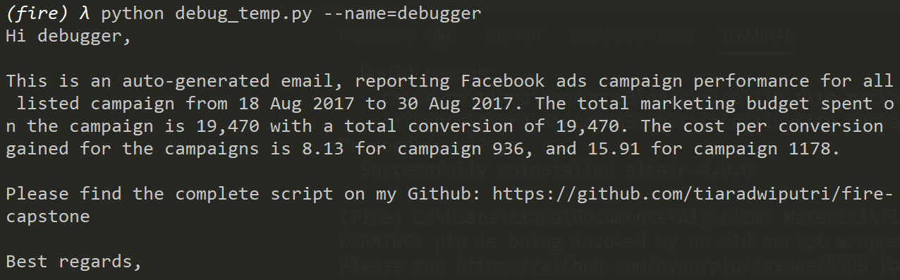
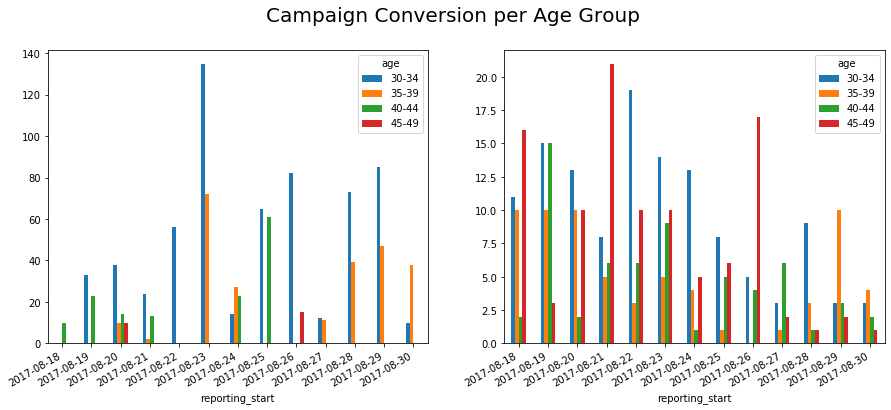

Versi ini adalah versi Bahasa Indonesia dari `README.md`.

# Auto Generated Email Based Report

Projek ini dikembangkan sebagai salah satu capstone project dari Algoritma Academy Data Analytics Specialization. Deliverables yang diharapkan adalah sebuah script Python yang bisa digunakan untuk mengirimkan email secara otomatis menggunakan SMTP Outlook email. Selain itu, kita juga akan menggunakan package `fire` untuk melakukan interfacing dengan CLI.

## Setup

Hal pertama yang harus dilakukan adalah melakukan pengaturan environment conda. Seluruh dependecies telah di-export ke dalam file `requirements.txt`. Untuk menyiapkan conda environment, silahkan gunakan command berikut:

```
conda env create -n <env_name> python=3.7
conda activate <env_name>
pip install -f requirements.txt
```
Untuk memudahkan proses drafting aplikasi, kita juga akan menggunakan Jupyter Notebook. Untuk itu, kita harus menyiapkan kernel terlebih dahulu dengan command berikut:

```
python -m ipykernel install --user --name=<env_name>
```

## The Challenge

Pada capstone projek ini terdapat 4 challenge yang harus dipenuhi:
1. Melakukan testing modularity menggunakan `fire`
2. Meng-extract informasi dari data source untuk membuat sebuah email
3. Masuk ke akun Outlook menggunakan library SMTP Python
4. Meng-export plot menggunakan matplotlib untuk di-attach pada email

Apabila seluruh challenge sudah selesai, akan terdapat final mission yang harus dikerjakan untuk mengirimkan sebuah Auto Generated Email pada alamat email yang akan disediakan. 

### Application Modularity

Pada bagian ini, kita akan mengeksplor cara untuk meng-extract daftar kontak dalam sebuah file eksternal yang disimpan di dalam file `templates/contacts.txt`. Tiap baris dalam file tersebut adalah sebuah daftar kontak yang ingin dikirimkan auto-generated email blast. Format yang digunakan untuk menuliskan daftar kontak adalah sebagai berikut:

`person name email`

Kata yang dituliskan di awal akan dianggap sebagai nama, dan yang akhir akan dianggap sebagai email. Sebagai contoh, kontak berikut:

`Team Algoritma mentor@algorit.ma`

akan dianggap sebagai 2 variabel:

- Name: Team Algoritma
- Email: mentor@algorit.ma

Function yang digunakan untuk mengambil daftar kontak tersebut dinamakan `extract_contacts` dalam script `send_email`. Untuk menguji function tersebut, kita akan coba memanfaatkan `fire`, silahkan salin kode di bawah dan simpan dalam sebuah file dengan nama `debug.py`:
```
from send_email import extract_contacts
import fire

if __name__ == '__main__':
  # Export to Fire
  fire.Fire(extract_contacts)
```
Kode di atas melakukan export function `extract_contacts` untuk dapat diakses melalui CLI. Jika script tersebut dijalankan, kita akan dapat mengakses functionnya dengan command berikut: `python debug.py --contact_file=templates/contacts.txt`.

Hasil dari command di atas adalah sebuah list dengan 2 elemen. Satu elemen menyimpan list nama kontak, dan satunya menyimpan list email. Silahkan edit file `contacts.txt` yang tersimpan dalam folder templates dan ganti nilainya dengan daftar kontak yang diinginkan. Sebagai ilustrasi, silahkan coba ganti dengan contoh email mentor@algorit.ma dan email pribadi. Jika file telah diganti, kita akan mendapatkan output sebagai berikut:


### Extract Information and Compose an Email

#### Using a Template Object

Untuk menuliskan sebuah body email dengan efektif, kita akan menggunakan objek `Template` dari Python. Objek ini akan dibangun dari file eksternal yang disimpan dalam `templates/body.txt`. Jika dibuka, kamu akan melihat sebuah template email beserta dengan beberapa variabel yang harus diisi:

- `PERSON_NAME`: Variable ini akan diisi sesuai dengan nama yang diekstrak dari bab [concact list](#application-modularity)
- `START_DATE`, `END_DATE`, `TOTAL_SPENT`, `TOTAL_CONVERSION`, dan `CPC`: Variabel ini akan diisi dengan informasi dari data source yang akan diekstrak dari function `extract_summary` menggunakan tools exploratory analysis yang disiapkan `pandas`. Bagian ini akan dibahas lebih lanjut dalam bab [data summary](#extracting-data-frame-summary)
- `GITHUB_LINK`: Link ini akan diisi dengan link repository GitHub yang di-declare pada function `compose_email`

Pembuatan objek `Template` dilakukan pada function `create_template`. Apabila kita menggunakan script `debug.py` seperti pada bab sebelumnya, maka outputnya akan menjadi sebagai berikut:


#### Extracting Data Frame Summary

Pada bab ini kita akan melakukan ekstraksi variabel-variabel yang dibutuhkan pada Template object: `START_DATE`, `END_DATE`, `TOTAL_SPENT`, `TOTAL_CONVERSION`, dan `CPC`. Prosesnya dapat dilihat pada function `extract_summary`. Data yang kita gunakan disimpan dalam file `data_input/data.csv` dan diunduh dari [Kaggle dataset repository](https://www.kaggle.com/madislemsalu/facebook-ad-campaign) yang disediakan oleh [Madis_Lemsalu](https://www.kaggle.com/madislemsalu). Dataset ini menyediakan reporting ads Facebook harian dari beberapa marketing campaign dari tanggal 18 sampai 30 Agustus 2017. Silahkan gunakan glossary berikut:
- ad_id: Unique identifier of the daily ads
- reporting_start: The start date of the generated report. Since it is a daily report, this variable and `reporting_end` will have the same value
- reporting_end: The end date of the generated report. Since it is a daily report, this variable and `reporting_start` will have the same value
- campaign_id: unique identifier of a campaign, one campaign could have several creative ads
- fb_campaign_id: Facebook's identifier of each running ads
- age: The age group on which the ad is promoted
- gender: The gender on which the ad is promoted
- interest1, interest2, and interest3: The interest group id on which the ad is promoted
- impressions: Number of people viewing the ad
- clicks: Number of people clicking the ad
- spent: Amount of marketing cost spent
- total_conversion: Number of conversions (commonly a buying action) happened
- approved_conversion: Number of approved conversions after cross checked with the actual business. In some cases, a conversion tracked by the ad doesn't really record with a complete buying action from the customers.

Pada bagian ini akan lebih mudah jika menggunakan Jupyter Notebook untuk melakukan proses data wrangling yang lebih kompleks. Function `extract_summary` diharapkan akan menghasilkan dictionary sebagai berikut:


Silahkan gunakan Jupyter Notebook untuk mengisi function `extract_summary` pada script `send_email.py` dengan kode yang sesuai. Kerangka menjawabnya pada scriptnya telah ditandai dengan tanda blank (`___`).

#### Composing an Email

Apabila telah berhasil melalui 2 langkah di atas, maka kita sudah dapat membangun body email. Gunakan script `debug_temp.py` yang telah tersedia dalam repository ini dan jalankan di CLI. Jika sukses, kita dapat melihat template email yang telah diisi nilainya dengan informasi yang sudah diekstrak dari data frame:



### SMTP Setup

Setup SMTP (Simple Mail Transfer Protocol) diatur dalam function `authenticate_account`. Host server yang digunakan adalah server Outlook mail. Untuk masuk dalam server, kita akan menggunakan library `smtplib` yang akan digunakan untuk mengatur otentikasi SSL dari email pribadi. Untuk alasan keamanan, kita akan melakukan set up environment variabel di komputer masing-masing yang dinamakan `EMAIL_ADDRESS` dan `EMAIL_PASSWORD`. Cara ini digunakan untuk mencegah adanya kebocoran informasi dengan mengetikkan informasi email dan password dalam script yang berisiko untuk tersebarluaskan.

Untuk memverifikasi environment variabel sudah di set up, gunakan kode Python berikut:
```
import os
print(os.environ['EMAIL_ADDRESS'])
print(os.environ['EMAIL_PASSWORD'])
```

Jika masing-masing variabel sudah berhasil di-print, kita akan masuk ke bab berikutnya.

### Create and Export a Plot

Pada bab ini, kita akan menyediakan sebuah plot yang akan di-attach pada email untuk menggambarkan performance dari data campaign Facebook yang kita punya. Implementasikan yang telah kita pelajari pada modul visualization dan buatlah sebuah bar plot sederhana menggunakan dataset `data_input/data.csv`. Function yang digunakan untuk membangun plot ini ada di dalam `create_plot`. Plot yang diharapkan adalah plot sebagai berikut:



Gunakan Jupyter Notebook untuk mencoba menghasilkan plot serupa dan cobalah isi tanda blank pada function `create_plot` pada script `send_message.py` dengan kode yang sesuai. Berikut langkah yang harus dikerjakan:

1. Silahkan baca dataset yang tersedia dan lakukan filter dari kolom `campaign_id` untuk campaign 936 dan 1178. Kedua campaign tersebut disimpan dalam sebuah parameter yang bisa diatur dengan nama `id`. Kita juga akan membuang semua baris yang berisi variable `spent` sama dengan 0. Hal ini untuk membersihkan data dari semua ads yang sebenarnya tidak berjalan di hari tersebut.

    ```
    fb = pd.read_csv(file_path, parse_dates=[1,2])
    campaigns = fb[fb['campaign_id'].isin(id)]
    campaigns = campaigns[campaigns.spent > 0]
    ```

2. Buatlah sebuah agregasi group by dari tiap campaign, date, dan age group, lalu kalkulasikan variabel `total_conversion` dari masing-masing grup.

    ```
    grouped = campaigns.groupby(by=['___', '___', '___'], as_index=False)['___'].___
    ```

3. Berikutnya, kita akan meyiapkan sebuah objek `figure` untuk menyimpan plot-plot yang akan kita buat. Setelah itu, kita akan melakukan iterasi untuk tiap campaign id dan membuat sebuah barplot dan menambahkannya ke objek `figure` dengan method `subplot`.

    ```
    fig = plt.figure(1, figsize=(15,6))
    
    # Iterate to create 1 plot campaign at a time
        for i, campaign in enumerate(grouped.campaign_id.unique()):
        plt.subplot(1, len(id), i+1)
        ...
    ```

4. Karena kita akan membangun sebuah plot untuk masing-masing campaign, code berikutnya dalam loop di atas adalah membangun sebuah bar plot untuk sebuah DataFrame `pandas`.

    ```
    df = grouped[grouped[___] == campaign].loc[:,['age', 'reporting_start', 'total_conversion']]
    df['reporting_start'] = df['reporting_start'].dt.date
    pivot = df.pivot(index='___', columns='___', values='___').fillna(0)
    pivot.plot.bar(ax=plt.gca())
    ```

    DataFrame `pivot` yang akan digunakan untuk membangun bar plot diharapkan memiliki struktur sebagai berikut:

    
5. Terakhir, kita akan melakukan sedikit adjustment pada plot dan menyimpannya dalam sebuah file PNG.
    ```
    fig.suptitle('Campaign Conversion per Age Group', fontsize=20)
    fig.autofmt_xdate()
    
    # Save file to plot folder
    imagename = 'plot/'+date.today().strftime(format="%d %b %Y")+'.png'
    fig.savefig(imagename)
    ```

Jika 5 langkah tersebut sudah berhasil dikerjakan, kita akan mendapatkan sebuah plot yang disimpan dengan nama tanggal hari ini di dalam folder `plot`. 
## Final Mission

Silahkan gunakan waktu di akhir untuk memahami function `main`. Function ini akan dipanggil menggunakan package `fire` saat script ini dipanggil. Hal ini akan membantu kita untuk mengakses function `main` pada CLI dengan menambahkan sebuah flag yang akan dimasukkan sebagai parameter dengan syntax: `--param=value`. Parameter yang dibutuhkan function ini adalah sebagai berikut:

- `subject`: Subject email yang dikirimkan
- `contact_file`: Jika mengikuti dengan baik, kita akan diharuskan untuk mengubah nilai default dari parameter ini
- `template_file`: Default di-set dengan `templates/body.txt`
- `data_file`: Default di-set dengan `tempaltes/data.csv`

Command CLI yang bisa dijalankan adalah sebagai berikut:
```
python send_email.py --subject="YOUR SUBJECT"
```
Jika semua komponen telah di set up dengan benar, cobalah untuk mengirimkan sebuah email otomatis ke `mentor@algorit.ma`. Final Mission yang harus dikerjakan untuk capstone project ini adalah dengan mengirimkan sebuah email otomatis yang menyertakan repository GitHub pribadi beserta dengan body dan plot yang diharapkan. Beirkut detailnya:

Subject: 
>[BATCH_NAME DA CAPSTONE] Facebook Email Report

Contoh:

>[IRIS DA CAPSTONE] Facebook Email Report

Body Template:

> Hi Team Algoritma,
>
> This is an auto-generated email, reporting Facebook ads campaign performance for all listed campaign from \${START_DATE} to \${END_DATE}. The total marketing budget spent on the campaign is \${TOTAL_SPENT} with a total conversion of \${TOTAL_CONVERSION}. The cost per conversion gained for the campaigns is \${CPC}.
>
>Please find the complete script on my Github: ${GITHUB_LINK}
>Best regards,


---
Good luck and happy coding!
